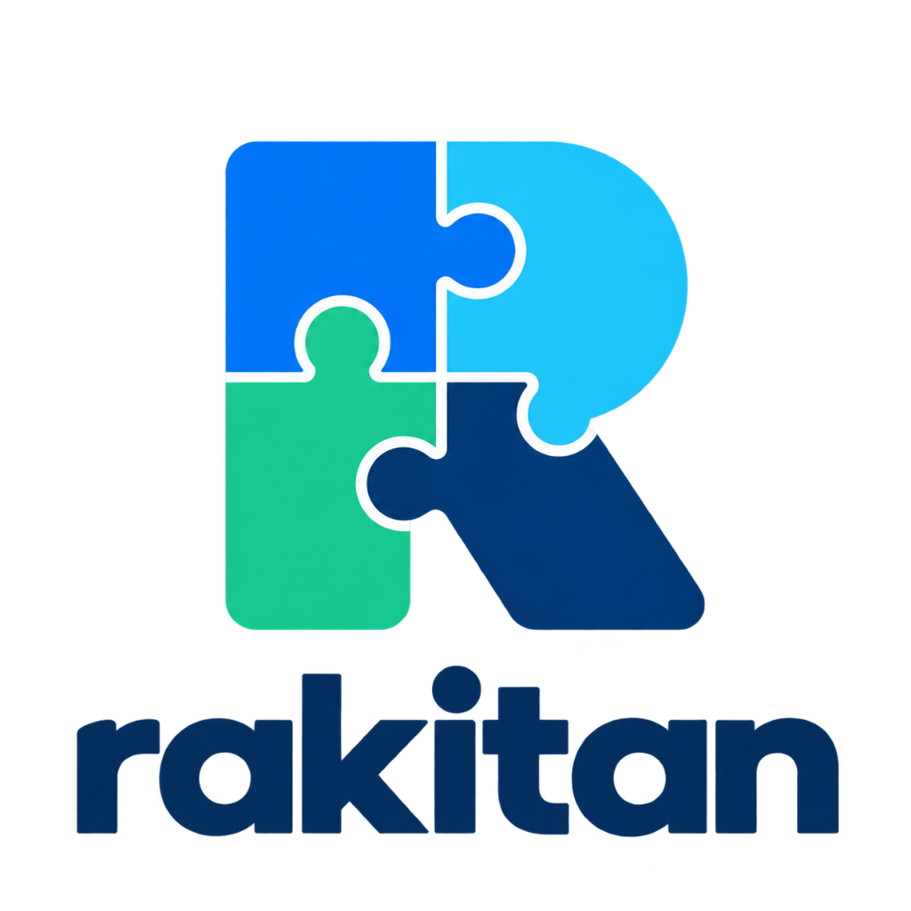

<p align="center">
  
</p>

<h1 align="center">Rakitan CMS</h1>

<p align="center">
  <strong>The Next-Generation Modular Open-Source CMS, Component-Driven Visual Builder, Theme & Plugin Ecosystem</strong>
</p>

<p align="center">
  <a href="https://laravel.com"></a>
  <a href="https://react.dev"></a>
  <a href="https://inertiajs.com"></a>
  <a href="https://tailwindcss.com"></a>
  <a href="LICENSE"></a>
  <a href="#contributing"></a>
</p>

---

## 🌟 Overview & Vision

**Rakitan** (*Indonesian for "Assembly" or "Custom Build"*) is a modern, modular, open-source Content Management System built with Laravel 11, Inertia.js v2, and React. Designed as a high-performance alternative to legacy CMS monoliths, Rakitan introduces an intuitive **"Puzzle-Block" architecture**, full-stack theme & plugin extensibility, a visual page builder, folder-based media management, dynamic blog engine, and enterprise-grade security.

Traditional CMS platforms often burden servers with hundreds of conflicting plugins, bloated databases, and fragile themes. **Rakitan** solves this with clean engineering:
- **Component-Driven Visual Builder**: Every content block is an isolated, reusable React module with live props inspection, micro-component slots, and responsive device previews.
- **Deep Theme Engine**: Themes can override any core visual block or micro-component natively, inject custom fonts, and provide distinct design tokens.
- **Decoupled Plugin Ecosystem**: Drop-in plugins register custom backend routes, API controllers, and frontend block definitions cleanly without core hacks.
- **Normalized Schema**: Page layouts and content blocks are stored as clean, structured JSON in MySQL.
- **Safe Reset & Tools**: One-click safe data wiping allows developers to start fresh without losing installed themes or plugins.

> 📢 **Rakitan is 100% Free and Open Source.** We are actively building an open community of developers, designers, and creators to shape the future of modular web publishing. We warmly welcome your contributions!

---

## 🚀 Key Features

### 1. 🧩 The "Puzzle Core" (Extensible Block Registry)
- **Zero-Bloat Architecture**: Blocks are self-contained modules (`resources/js/Blocks/Definitions/`) registered in a central registry (`registry.js`).
- **Standard & Advanced Production Blocks**:
  - 🌟 **Hero Section**: Dual action buttons, badge pill, gradient/solid/image backgrounds, and alignment controls.
  - ⚡ **Feature Grid**: 2, 3, or 4 responsive columns with Lucide icons, badges, and titles.
  - 📝 **Rich Text / Article**: Clean typography, container width options, and built-in XSS sanitization via `DOMPurify`.
  - 🖼️ **Media Gallery**: Image showcase grid with hover captions and smooth scale animations.
  - 📢 **Call to Action (CTA)**: High-conversion closing banner with gradient, boxed card, or minimalist styles.
  - 💳 **Pricing Table**: Tiered pricing cards with feature lists, popular badges, and CTA buttons.
  - ❓ **FAQ Accordion**: Expandable interactive Q&A accordion items.
  - 📬 **Contact & Lead Form**: Integrated contact form with input fields that route directly into the Form Submissions Inbox.
  - 📏 **Spacer & Divider**: Vertical whitespace controller and decorative separator lines.

### 2. 🎨 Drag-and-Drop Visual Page Builder
- **Powered by `@dnd-kit`**: Smooth vertical sorting with a dedicated Smart Pointer Sensor to prevent cursor freezing and drag conflicts.
- **Responsive Viewport Switcher**: Instantly preview how pages look on **Desktop (100%)**, **Tablet (768px)**, and **Mobile (375px)** directly inside the canvas.
- **3-Panel Layout**:
  - **Left Panel**: Puzzle Palette (filter by category, live search) & Page Structure Outline Tree.
  - **Center Canvas**: Interactive live preview canvas with instant reorder, duplicate, delete, and move actions.
  - **Right Panel**: Sleek, high-contrast dark inspector for editing block properties, styles, micro-components, and page-level SEO metadata.
- **Page Layout Modes**: Switch between **Default Layout**, **Blank Canvas**, **Landing Page**, and **Full Width**.
- **Undo / Redo History**: Multi-step history management with live saving indicators.

### 3. 🎨 Theme System with Deep Component Overrides
- **Custom Themes**: Themes live in `/themes/{theme-id}/` with a declarative `theme.json` manifest.
- **Component Overrides**: Themes can override default block components (e.g. `overrides/HeroBlock.jsx`) and micro-components without modifying core files.
- **Custom Fonts & CSS**: Automatic loading of Google Fonts and theme stylesheets (`style.css`).
- **Shipped Themes**:
  - 🌙 **Default Dark**: Modern, high-tech glassmorphism dark theme.
  - ☀️ **Clean Light**: High-contrast, clean corporate aesthetic with distinct typography.

### 4. 🔌 Modular Plugin Architecture
- **Drop-In Plugins**: Plugins reside in `/plugins/{plugin-id}/` with a `plugin.json` manifest.
- **Lifecycle Management**: Activate, deactivate, and delete plugins via the Admin UI (`/admin/plugins`).
- **Backend & Frontend Hooks**: Plugins can register custom Laravel routes, controllers, and inject custom React blocks into the Visual Builder registry.
- **Shipped Plugins**:
  - 🔍 **Rakitan SEO Optimizer**: Real-time content analysis, keyword density tracking, and meta preview.
  - 👋 **Hello Rakitan**: Developer demo plugin showcasing custom routes and block extensions.

### 5. 📁 Media Library with Folders & Drag-Drop Upload
- **Folder Organization**: Create, rename, and nest media folders.
- **Drag-and-Drop Uploads**: Upload multiple images and files effortlessly.
- **Universal Media Picker**: Integrated modal picker across the Post editor, Block inspector, and Theme customizer.

### 6. 📰 Dynamic Blog & Content Management
- **Posts & Categories**: Full blogging pipeline with slug generation, excerpts, and categorization.
- **Rich Text Authoring**: Formatting, headings, blockquotes, and featured image integration.
- **Public Blog Archives**: Built-in `/blog` index and `/{slug}` post routing.

### 7. 🧭 Dynamic Menu & Navigation Builder
- **Visual Menu Builder**: Create and reorder primary header and footer navigation links (`/admin/menus`).
- **Link Types**: Link directly to Pages, Blog Posts, Categories, or custom external URLs.

### 8. 👥 Roles & Permissions Management
- **Role-Based Access Control**:
  - 👑 **Administrator**: Unrestricted access to Settings, Plugins, Themes, Tools, Users, and Pages.
  - ✍️ **Editor**: Streamlined access focused on Blog Posts, Pages, and Media Library.

### 9. 📬 Contact Form Submissions Inbox
- View, search, and manage leads sent through frontend Contact Form blocks (`/admin/forms/submissions`).

### 10. 🧹 Safe Website Reset Tool
- **One-Click Fresh Start** (`/admin/tools`):
  - Cleans demo content, custom pages, blog posts, form leads, and uploaded media.
  - Re-seeds default clean pages (Home, About) and default menu.
  - **Preserves Files**: Keeps installed themes and plugins safe in their directories, setting active theme to default and plugins to inactive.
  - **Secured with Admin Password**: Requires active administrator password confirmation.

### 11. 📖 In-CMS Developer Documentation
- Native developer documentation directly in the admin dashboard (`/admin/documentation`):
  - **Plugin Development**: Folder structure, manifest options, backend routing, and block registration.
  - **Theme Development**: Overriding components, font importing, and CSS styling.
  - **Blocks & Micro-Components API**: Reference guide for block schemas and slot components.
  - **System Architecture**: JSON schema normalization, security best practices, and contribution rules.

---

## 🛠️ Tech Stack

| Layer | Technology |
|---|---|
| **Backend Framework** | [Laravel 11.x](https://laravel.com) (PHP 8.2+) |
| **Frontend Adapter** | [Inertia.js v2](https://inertiajs.com) (React 18/19) |
| **Styling & Design System** | [Tailwind CSS v3](https://tailwindcss.com) & Modern CSS Tokens |
| **Drag & Drop Engine** | [@dnd-kit/core](https://dndkit.com), `@dnd-kit/sortable`, Smart Pointer Sensor |
| **Icons** | [Lucide React](https://lucide.dev) |
| **Database** | MySQL / MariaDB (utilizing native JSON columns) |
| **Sanitization** | [DOMPurify](https://github.com/cure53/DOMPurify) |

---

## 📦 Getting Started

### Prerequisites
- PHP >= 8.2 with extensions: `pdo_mysql`, `mbstring`, `openssl`, `xml`, `tokenizer`, `fileinfo`
- Composer >= 2.0
- Node.js >= 18 & npm
- MySQL >= 8.0 or MariaDB >= 10.4

### 1. Clone & Setup
```bash
git clone https://github.com/your-org/rakitan.git
cd rakitan

# Copy environment template
cp .env.example .env

# Install PHP dependencies
composer install

# Install Node dependencies
npm install
```

### 2. Configure Environment & Database
Update `.env` with your database credentials:
```env
APP_NAME="Rakitan CMS"
APP_URL=http://localhost:8000

DB_CONNECTION=mysql
DB_HOST=127.0.0.1
DB_PORT=3306
DB_DATABASE=db_rakitan
DB_USERNAME=root
DB_PASSWORD=your_password
```

### 3. Generate App Key & Run Initial Migration
```bash
php artisan key:generate
php artisan storage:link
php artisan migrate
```

### 4. Seed Initial Content
```bash
php artisan db:seed
```

### 5. Start Development Servers
```bash
# Terminal 1: Laravel Backend
php artisan serve

# Terminal 2: Vite Frontend Dev Server
npm run dev
```

Visit `http://localhost:8000` in your browser.

---

## 🧙 Web Installation Wizard (Zero-Config)

Rakitan CMS also includes a sleek, WordPress-style interactive web setup wizard:

1. Start your servers (`php artisan serve` and `npm run dev`).
2. Navigate to `http://localhost:8000/`.
3. If not yet installed, you will be redirected to the 4-step wizard at `/install`:
   - **Step 1: System Requirements**: Checks PHP version, extensions, and file write permissions.
   - **Step 2: Database Connection**: Test and connect to MySQL. Can automatically create the database if it doesn't exist yet!
   - **Step 3: Site & Admin Account**: Setup Site Title, Admin Name, Email, and Password.
   - **Step 4: Installation Complete**: Instant redirection to the admin dashboard.

> 💡 **To re-run the installer anytime**: Remove the lock file:
> ```bash
> rm -f storage/installed
> ```

### 🔑 Default Credentials (from Seeder)
- **Email**: `admin@rakitan.test`
- **Password**: `password`

---

## 🧩 Developer Guides

### 1. Creating a Custom Theme
Themes reside in the `/themes` directory:
```
themes/
└── my-custom-theme/
    ├── theme.json
    ├── preview.png
    ├── style.css
    └── overrides/
        ├── HeroBlock.jsx
        └── FeatureGridBlock.jsx
```

Sample `theme.json`:
```json
{
  "id": "my-custom-theme",
  "name": "My Custom Theme",
  "version": "1.0.0",
  "author": "Rakitan Developer",
  "description": "Clean light corporate theme with serif headings.",
  "colors": {
    "primary": "#2563eb",
    "background": "#ffffff",
    "text": "#0f172a"
  },
  "fonts": {
    "sans": "Inter",
    "serif": "Merriweather"
  }
}
```

### 2. Creating a Custom Plugin
Plugins reside in the `/plugins` directory:
```
plugins/
└── analytics-tracker/
    ├── plugin.json
    ├── routes.php
    └── Plugin.php
```

Sample `plugin.json`:
```json
{
  "id": "analytics-tracker",
  "name": "Analytics Tracker",
  "version": "1.0.0",
  "author": "Rakitan Developer",
  "description": "Injects custom analytics snippets and conversion tracking.",
  "routes": "routes.php"
}
```

For comprehensive tutorials, open the in-CMS guide at **Admin > Documentation** (`/admin/documentation`).

---

## 🧪 Automated Testing

Rakitan comes with automated feature tests covering authentication, page builder mutations, dynamic routing, plugin management, tools reset, and XML migrations:

```bash
# Run feature test suite
php artisan test
```

> ⚠️ **Testing Policy**: All tests use isolated test data and transactions. Database truncates and `migrate:fresh` are strictly forbidden.

---

## 🤝 Contributing to Rakitan

We believe the future of content management belongs to open, community-driven software. Whether you are fixing bugs, improving documentation, designing new block templates, or optimizing performance, **your contribution is deeply appreciated!**

### How You Can Help:
1. **⭐ Star & Share**: Help spread the word to developers looking for a modern WordPress alternative.
2. **🧩 Build New Blocks**: Create community blocks (Pricing, FAQ, Newsletter, Video) and submit a pull request.
3. **🎨 Design Themes**: Build beautiful modern themes and share them with the community.
4. **🔌 Develop Plugins**: Build integrations with analytics, SEO, social sharing, and headless APIs.
5. **🐛 Report Issues**: Found a bug or have an idea? Open an issue on our tracker with clear reproduction steps.

---

## 📜 License

Rakitan CMS is open-source software licensed under the [MIT License](LICENSE). Feel free to use it for personal projects, commercial client websites, and SaaS applications.
